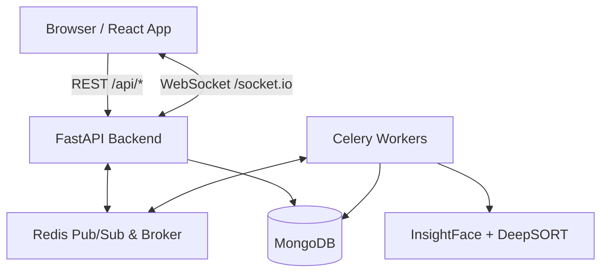

# 🛡️ AI-Enhanced Surveillance System

<div align="center">
  
</div>

> A production-ready, zero-cost AI surveillance platform with real-time face recognition, live RTSP stream processing, and multi-channel alert dispatch.

<div align="center">

  [](https://opensource.org/licenses/Apache-2.0)
  [](https://www.python.org/downloads/)
  [](https://nodejs.org/)
  [](https://fastapi.tiangolo.com/)
  [](https://reactjs.org/)
</div>

---

## 📖 Table of Contents
- [Features](#-features)
- [Tech Stack](#-tech-stack)
- [Architecture](#-architecture)
- [Prerequisites](#-prerequisites)
- [Quick Start](#-quick-start)
- [API Reference](#-api-reference)
- [Alert Channels Setup](#-alert-channels-setup)
- [Troubleshooting](#️-troubleshooting)

---

## ✨ Features

<div align="center">
  
</div>

### 🧑‍🤝‍🧑 Person Enrollment
* **Intelligent Enrollment:** Enroll suspects, victims, or accused persons with a face photo.
* **High Accuracy:** Add multiple images per person — embeddings are averaged for superior accuracy.
* **Instant Search:** Quick image search to identify a person from any uploaded photo.

### 📹 Live Camera Streams
* **Universal Support:** Register RTSP cameras, IP cameras, or webcams (source `0`).
* **Granular Control:** Start/stop streams from the UI — each stream runs as an isolated Celery task.
* **Custom Configuration:** Per-camera settings for match threshold, frame skip, and GPS coordinates.
* **Targeted Alerts:** Per-camera police station alert routing via Webhook, Telegram, and ntfy.

### 🖼️ Media Analysis
* **Offline Processing:** Upload images or videos for offline face matching.
* **Background Jobs:** Video jobs run in the background with granular per-frame progress tracking.

### 🚨 Detection & Alerting
| Confidence Score | Threat Level | Automated Action |
|:---:|:---:|---|
| **≥ 0.60** | 🔴 **HIGH** | Auto-alert dispatched to all configured channels |
| **0.45–0.59** | 🟡 **REVIEW** | Saved to Review Queue for operator confirmation |
| **< 0.45** | ⚪ **LOW** | Not recorded |

* **Multi-Channel:** Per-person & Per-camera routing to Telegram, Email, ntfy.sh, and Webhooks.
* **Smart Throttling:** 60-second cooldown per person per camera to prevent alert spam.

<div align="center">
  
</div>

---

## 🛠 Tech Stack

| Layer | Technology |
|---|---|
| **Face Recognition** | InsightFace `buffalo_l` — ArcFace R100 (99.77% LFW) |
| **Face Detection** | RetinaFace (bundled in InsightFace) |
| **Multi-object Tracking** | DeepSORT (`deep-sort-realtime`) |
| **Backend API** | FastAPI + python-socketio (single ASGI process) |
| **Task Queue** | Celery + Redis |
| **Database** | MongoDB 7 — Motor (async) + pymongo (sync) |
| **Frontend** | React 18 + TypeScript + Vite + Tailwind CSS |
| **Real-time Events** | Socket.IO over Redis Pub/Sub |
| **Alert Channels** | Telegram Bot API, Gmail SMTP, ntfy.sh, HTTP Webhooks |

---

## 🏗 Architecture



**Key Design Decisions:**
- `socketio.ASGIApp` wraps FastAPI — single process, single port 8000.
- Workers publish detection events to Redis channel `"detections"`; a FastAPI background coroutine subscribes and re-emits via Socket.IO to all browser clients.
- All enrolled embeddings are loaded into a `(N, 512)` numpy matrix at startup — matching is one `matmul` call, O(1) regardless of enrolled persons count.
- DeepSORT tracks identities across frames and averages embeddings over a 5-frame buffer — reduces false positives from motion blur and partial occlusion.

---

## 🚀 Quick Start

### Prerequisites
- **Docker Desktop** (provides Redis & optionally MongoDB)
- **Python 3.10+**
- **Node.js 18+**

> ⚠️ **Windows users**: If you have a native MongoDB service installed, please read the [MongoDB setup section](#mongodb-setup-windows) before proceeding.

### 1. Clone & Configure
```bash
cd AI-Enhanced-Surveillance
cp backend/.env.example backend/.env
```
Edit `backend/.env` with your desired configuration (Alert channels are optional).

### 2. Start Infrastructure
```bash
docker compose up -d
```

### 3. Start Backend
```bash
cd backend
python -m venv .venv

# Windows:
.venv\Scripts\activate
# macOS/Linux:
source .venv/bin/activate

pip install -r requirements.txt
uvicorn app.main:app --reload --host 0.0.0.0 --port 8000
```
> 💡 *Note: The first run downloads the InsightFace `buffalo_l` model (~180 MB).*
> 🪟 *Windows users need [Visual C++ Build Tools](https://visualstudio.microsoft.com/visual-cpp-build-tools/) installed for InsightFace.*

### 4. Start Celery Worker (In a new terminal)
```bash
cd backend
.venv\Scripts\activate   # or source .venv/bin/activate

# Windows (must use threads pool):
celery -A app.tasks.celery_app worker --loglevel=info --pool=threads --concurrency=4

# macOS/Linux:
celery -A app.tasks.celery_app worker --loglevel=info
```

### 5. Start Frontend (In a new terminal)
```bash
cd frontend
npm install
npm run dev
```
Open [http://localhost:5173](http://localhost:5173) in your browser! 🎉

---

## 📡 API Reference

Access interactive Swagger docs at: [http://localhost:8000/docs](http://localhost:8000/docs)

<details>
<summary>Click to expand basic API routes</summary>

| Method | Path | Description |
|---|---|---|
| GET | `/health` | System health + enrolled person count |
| GET | `/api/persons` | List enrolled persons |
| POST | `/api/persons` | Enroll person |
| POST | `/api/cameras` | Register camera |
| POST | `/api/cameras/{id}/start` | Start stream worker |
| POST | `/api/media/upload` | Upload media for analysis |
| GET | `/api/detections` | Detections history |

</details>

---

## 🔔 Alert Channels Setup

### Telegram
1. Message [@BotFather](https://t.me/botfather) → `/newbot` → copy the token.
2. Start a DM with the bot, then fetch the chat ID: `https://api.telegram.org/bot<TOKEN>/getUpdates`.
3. Set `TELEGRAM_BOT_TOKEN` in `.env`.

### Gmail
1. Enable 2-Step Verification on your Google account.
2. Go to **Security → App Passwords** and create one for "Mail".
3. Use the 16-character app password as `SMTP_PASS`.

### ntfy.sh
1. No account needed — pick any unique topic name.
2. Subscribe at `https://ntfy.sh/<your-topic>` or via the mobile app.
3. Enter the topic name per-person or per-camera in the UI.

---

## ⚙️ Environment Variables

| Variable | Default | Description |
|---|---|---|
| `MONGO_URI` | `mongodb://localhost:27017/` | MongoDB connection string |
| `MONGO_DB_NAME` | `AI_Enhanced_Service` | Database name (case-sensitive) |
| `REDIS_URL` | `redis://localhost:6379/0` | Redis connection string |
| `UPLOADS_DIR` | `uploads` | Directory for face crop snapshots |
| `TELEGRAM_BOT_TOKEN` | — | From `@BotFather` |
| `SMTP_HOST` | `smtp.gmail.com` | SMTP server |
| `NTFY_BASE_URL` | `https://ntfy.sh` | ntfy server URL |

---

## 🛠️ Troubleshooting

<details>
<summary><b>DatabaseDifferCase error on startup</b></summary>
A database with a different case (<code>AI_Enhanced_service</code>) already exists. Drop it:

```python
python -c "from pymongo import MongoClient; MongoClient().drop_database('AI_Enhanced_service')"
```
</details>

<details>
<summary><b>Celery not processing tasks on Windows</b></summary>
Must use `--pool=threads`. The default prefork pool requires fork() which is unavailable on Windows.
</details>

<details>
<summary><b>InsightFace install fails</b></summary>
Install Visual C++ Build Tools first: <a href="https://visualstudio.microsoft.com/visual-cpp-build-tools/">Visual Studio</a>
</details>

<details id="mongodb-setup-windows">
<summary><b>Port 27017 conflict / Native MongoDB on Windows</b></summary>
Windows often ships with a native MongoDB service that conflicts with the Docker container. 
Check with: <code>Get-Service -Name "*mongo*"</code>

Either stop it in Admin PowerShell:
<code>Stop-Service MongoDB</code>

Or stop the Docker Mongo and use the native one:
<code>docker compose stop mongo</code>
</details>

---


## 💖 Support

Consider supporting by:

<p align="center">
  <a href="https://patreon.com/Chaitanya888"></a>
  &nbsp;
  <a href="https://buymeacoffee.com/chaitanya888"></a>
</p>

<br/>

---


## 📜 License
Distributed under the Apache-2.0 License. See [LICENSE](./LICENSE) for more information.

---
