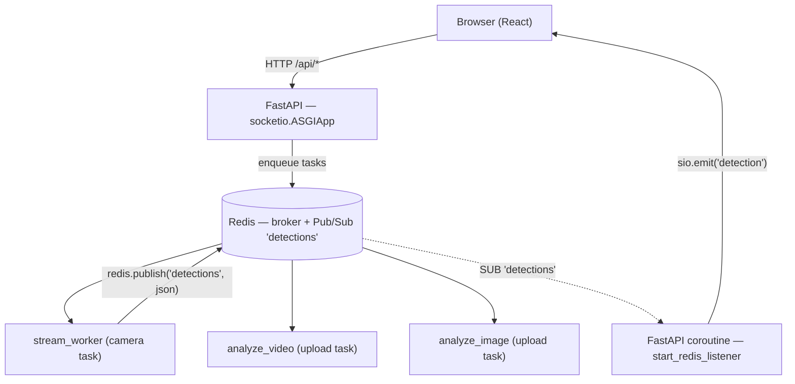
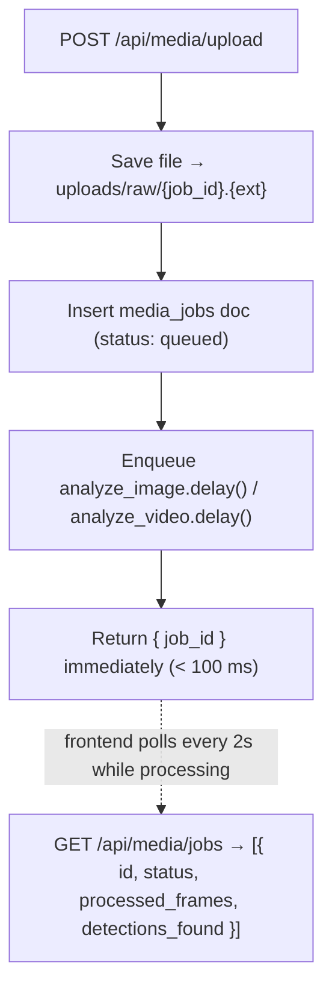

# Real-Time Processing Strategy

---

## The Problem

Face recognition on video takes 200–500 ms per frame on CPU. It must never block the HTTP server — one active camera stream would make the entire API unresponsive.

**Solution:** Celery workers own all AI work. FastAPI is a pure I/O process: accepts requests, enqueues tasks, relays events to browsers over WebSocket.

---

## Architecture (As Built)



FastAPI and Socket.IO share one process via `socketio.ASGIApp`:

```python
_fastapi = FastAPI(...)
app = socketio.ASGIApp(sio, other_asgi_app=_fastapi)
# uvicorn serves `app`, not `_fastapi`
```

The Redis listener runs as a background `asyncio` task started in the FastAPI lifespan:

```python
@asynccontextmanager
async def lifespan(app):
    await connect_db()
    asyncio.create_task(start_redis_listener())
    yield
    await close_db()
```

---

## Three Celery Task Types

### `analyze_image` — short-lived (< 1 s)

Triggered by `POST /api/media/upload` with an image file.

```python
@celery_app.task
def analyze_image(job_id: str, image_path: str):
    frame = cv2.imread(image_path)
    pipeline = _build_pipeline(...)
    result = pipeline.run(frame)
    if result.matches:
        for match in result.matches:
            _handle_match(db, frame, match, ...)
    db.media_jobs.update_one({"_id": job_id}, {"$set": {"status": "done"}})
```

### `analyze_video` — medium-lived (seconds to minutes)

```python
@celery_app.task
def analyze_video(job_id: str, video_path: str):
    reader = StreamReader(video_path, frame_skip=5)
    seen_persons = set()   # one detection per person per video
    for i, frame in enumerate(reader.frames()):
        result = pipeline.run(frame)
        for match in result.matches:
            if match.person_id not in seen_persons:
                seen_persons.add(match.person_id)
                _handle_match(db, frame, match, ...)
        if i % 50 == 0:
            db.media_jobs.update_one({"_id": job_id},
                {"$set": {"processed_frames": i}})
```

Frontend polls `GET /api/media/jobs` every 2 seconds while status is `processing`.

### `stream_worker` — long-running (indefinite)

Started by `POST /api/cameras/{id}/start`. Runs until manually stopped.

```python
@celery_app.task(bind=True)
def stream_worker(self, camera_id: str):
    camera = get_camera_sync(camera_id)
    reader = StreamReader(camera["source"], camera["frame_skip"])
    tracker = PersonTracker()
    cooldown: dict[str, datetime] = {}
    frame_count = 0

    for frame in reader.frames():
        frame_count += 1
        if frame_count % 100 == 0:
            persons = _load_persons(db)   # pick up new enrollments
            pipeline.matcher.load(persons)

        result = pipeline.run(frame)
        tracks = tracker.update(result.faces, frame)

        for track in tracks:
            if track["already_alerted"]:
                continue
            match = pipeline.matcher.find_match(track["embedding"])
            if not match:
                continue
            name = match["person"]["name"]
            if (datetime.utcnow() - cooldown.get(name, MIN_DATE)).seconds < 60:
                continue
            cooldown[name] = datetime.utcnow()
            tracker.mark_alerted(track["track_id"])
            _handle_match(db, frame, match, camera, ...)
            redis_client.publish("detections", json.dumps({...}))

    # On exit: mark camera inactive
    db.cameras.update_one({"_id": camera_id}, {"$set": {"is_active": False}})
```

Stop by revoking the task:

```python
celery_app.control.revoke(task_id, terminate=True)
```

---

## Socket.IO Event Format

Event name: `"detection"`

```json
{
  "detection_id": "664abc123...",
  "person_name": "John Doe",
  "score": 0.81,
  "confidence": "HIGH",
  "camera_name": "Gate 1 North",
  "timestamp": "2026-05-12T10:32:00Z"
}
```

Frontend hook:

```typescript
// src/hooks/useSocket.ts
export function useDetectionSocket(onDetection: (data: LiveEvent) => void) {
  const socket = getSocket()
  useEffect(() => {
    socket.on('detection', onDetection)
    return () => { socket.off('detection', onDetection) }
  }, [onDetection])
}
```

---

## Media Upload Flow



---

## Windows-specific: Thread Pool

Celery defaults to the `prefork` pool (multiprocessing) which requires `fork()` — not available on Windows.

Always start the worker with:

```bash
celery -A app.tasks.celery_app worker --loglevel=info --pool=threads --concurrency=4
```

This is configured by default in `celery_app.py` (`worker_pool = "threads"`), but the CLI flag overrides it explicitly and is safer.

---

## Redis Pub/Sub vs Celery Result Backend

| | Celery result backend | Redis Pub/Sub |
|---|---|---|
| Purpose | Store task return values | Broadcast detection events |
| Consumer | FastAPI polling task state | FastAPI → Socket.IO → browser |
| Retention | Until `result_expires` (1h) | Fire-and-forget |
| Used for | Media job status | Live detection feed |

Both use Redis; they're separate logical uses of the same Redis instance.
